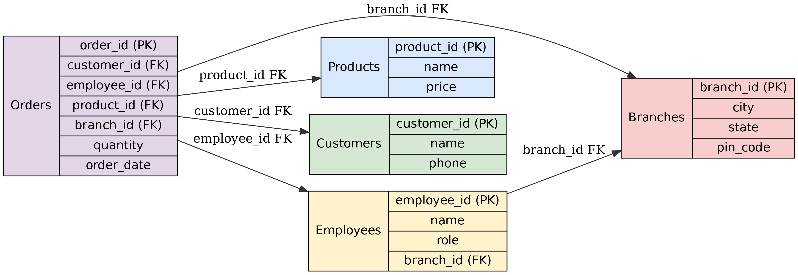

# ☕ TEA_SHOP_BUSINESS

# Tea Shop SQL Database Project
This project provides a complete SQL database for a Tea Shop Business in India. It includes schema creation, sample data, ER diagram, and essential SQL queries for business insights.

---

## 📂 Project Files

- `creat_table.sql` – Table creation script
- `insert_data.sql` – Data insert script (Branches, Products, Customers, Employees, Orders)
- `tea_shop_code.sql` – 10 query examples for analysis
- `schema_tea_shop.png` – ER Diagram showing all relationships
- `README.md` – shortcut red the project
- 'tea_shop_output'- analyes the tea shop business   

---

## 🧱 Database Schema

### 🔸 Branches
- `branch_id` **(PK)**
- `city`
- `state`
- `pin_code`

### 🔸 Products
- `product_id` **(PK)**
- `name`
- `price`

### 🔸 Customers
- `customer_id` **(PK)**
- `name`
- `phone`

### 🔸 Employees
- `employee_id` **(PK)**
- `name`
- `role`
- `branch_id` **(FK → Branches)**

### 🔸 Orders
- `order_id` **(PK)**
- `customer_id` **(FK → Customers)**
- `employee_id` **(FK → Employees)**
- `product_id` **(FK → Products)**
- `branch_id` **(FK → Branches)**
- `quantity`
- `order_date`

---

## 🔍 SQL Query Examples (10)

See `tea_shop_code.sql` for implementation:

1. **Total revenue from all branches**
2. **Top 5 most sold tea products**
3. **Orders from PIN code `'700001'`**
4. **Order count per branch**
5. **Top-performing employee**
6. **Average quantity per order**
7. **Recent 7-day orders**
8. **Frequent customers (5+ orders)**
9. **Revenue per product**
10. **Orders grouped by employee role**

---

## 🖼️ ER Diagram

This image shows the table relationships, primary keys, and foreign keys:

> Make sure this image is in the same directory when viewing on GitHub or a Markdown viewer.

---

## 🧾 License

For academic and educational use only.
